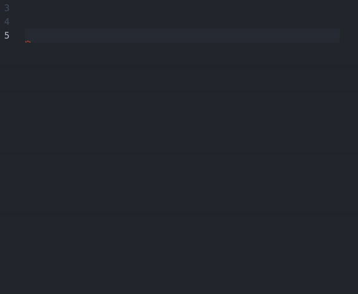

# vscode console.log 쉽게 찍기


프론트엔드 개발을 하다보면 다양한 목적으로 `console.log()`를 자주 사용하게 되는데 매번 모든 철자를 타이핑하는건 너무 귀찮고 `log` 세 글자를 타이핑하는 것조차 귀찮을 때가 있다.

더구나 `console.log()`를 여러개 동시에 찍고 있을 경우 구분을 위해 플레인 텍스트를 함께 작성해주는 경우엔 더욱 귀찮아진다.

`ex) console.log(state, "this is state")`

이 문제를 vscode에서 제공하는(대부분의 IDE에서 제공하는) `단축어 기능`을 사용해 쉽게 해결해보자.

---

#### **사용 방법**

1. vscode > code > 기본설정 > `사용자 코드 조각 구성`

2. `사용자 코드 조각 구성`을 클릭했을 때 나타는 검색창에 단축어를 사용하고자 하는 확장자 파일을 검색해서 선택

` ex) typescript.json || tsx.json || etc`

3. 확장자를 선택하면 json 파일이 열리고 아래와 같은 예시 코드가 미리 작성되어 있다.

```json
{
  "Print to console": {
    "prefix": "log",
    "body": ["console.log('$1');", "$2"],
    "description": "Log output to console"
  }
}
```

- Print to console: 단축어 이름
- prefix: 사용하고자 하는 단축어
- body: 단축어를 입력하고 tab을 눌렀을 때 만들어질 코드 조각
- description: 단축어 설명
- $1, $2... tab을 눌렀을 때 커서의 순서 (단축어를 입력 후 tab을 누르면 코드조각 생성과 동시에 $1의 위치에 커서가 위치하고 다시 한 번 tab을 누르면 $2 위치로 커서가 이동한다.)

4. 모든 필드를 자신의 취향대로 채운 후 저장한다.

5. 지정했던 확장자의 파일에 가서 설정한 단축어를 입력한 후 tab을 누르면 지정한 코드 조각이 나오는 것을 확인할 수 있다.

---

#### **사용 예시**

```json
{
  "Print to stringConsole": {
    "prefix": "T",
    "body": ["console.log('$1');"]
  },
  "Print to variableConsole": {
    "prefix": "V",
    "body": ["console.log($1, '$1');"]
  },
  "Print to function": {
    "prefix": "F",
    "body": ["function $1() {\n  $2\n}"]
  },
  "Print to useState": {
    "prefix": "S",
    "body": ["const [$1, set$2] = useState();"]
  },
  "Print to useEffect": {
    "prefix": "E",
    "body": ["useEffect(() => {\n  $1\n},[$2]);"]
  },
  "Print to import": {
    "prefix": "I",
    "body": ["import $1 from $2"]
  }
}
```
---

#### **데모 영상**


